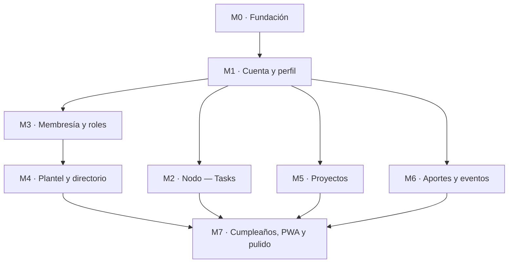

# 🗺️ Roadmap — Backoffice de Nodo Serrano

> Este es el **mapa central** (MOC) del roadmap de implementación. Abrí la carpeta `docs/` como **vault de Obsidian** para navegar los enlaces `[[...]]`.

Fuente de verdad del producto: [[2026-07-20-nodo-serrano-backoffice-design|PRD]] · Diseño: `design/nodo-serrano.pen` (37 pantallas).

## Visión

PWA mobile-first, backoffice de la comunidad Nodo Serrano. Un serrano se define por dos ejes: **Tier** (aporte económico) y **Rol** (aporte comunitario) — ver [[Glosario]]. El backend es Supabase (ver [[Stack técnico]]).

## Cómo leer este vault

- **Milestones** (`M0`…`M7`): unidades entregables y testeables. Cada una linkea a las pantallas del diseño, al [[Modelo de datos]] y a [[Seguridad RLS]].
- **Referencia**: notas transversales que muchos milestones consumen.
- **[[Backlog]]**: lo parkeado (ej. Puntos Serrano).

## Milestones

| # | Milestone | Foco | Estado |
|---|-----------|------|--------|
| M0 | [[M0 · Fundación]] | Scaffold, tokens, Supabase, deploy | 🔲 todo |
| M1 | [[M1 · Cuenta y perfil]] | Auth + profiles + onboarding | 🔲 todo |
| M2 | [[M2 · Nodo — Tasks]] | Cargar/tomar tareas (primer feature a validar) | 🔲 todo |
| M3 | [[M3 · Membresía y roles]] | Solicitud, tiers, roles, admin | 🔲 todo |
| M4 | [[M4 · Plantel y directorio]] | Plantel, detalle, filtros | 🔲 todo |
| M5 | [[M5 · Proyectos]] | Crear, ingreso, admins de proyecto | 🔲 todo |
| M6 | [[M6 · Aportes y eventos]] | Registrar aportes, agenda, RSVP | 🔲 todo |
| M7 | [[M7 · Cumpleaños, PWA y pulido]] | Cumples, offline, install, dark mode | 🔲 todo |

## Dependencias

> **Orden sugerido:** M0 → M1 → **M2 (validar Tasks rápido)** → M3 → M4 → M5 → M6 → M7. M2 se adelanta a propósito para probar el flujo de cargar tareas cuanto antes.

## Referencia

- [[Modelo de datos]] — tablas y relaciones
- [[Seguridad RLS]] — reglas de acceso en Postgres
- [[Stack técnico]] — Next.js + Supabase + Vercel
- [[Design system]] — tokens, componentes, archivo `.pen`
- [[Glosario]] — Tier, Rol, Serrano, Tourist, Aporte, Puntos
- [[Backlog]] — parkeado / futuro
